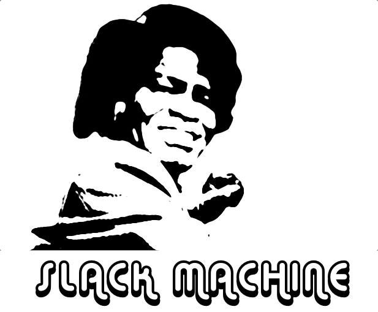

# Slack Machine

Slack Machine is a sexy, simple, yet powerful and extendable Slack bot.
More than just a bot, Slack Machine is a framework that helps you
develop your Slack workspace into a ChatOps powerhouse.

## Features

- Get started with mininal configuration
- Built on top of the [Slack RTM API](https://api.slack.com/rtm) for smooth, real-time
  interactions
- Support for rich interactions using the [Slack Web API](https://api.slack.com/web)
- High-level API for maximum convenience when building plugins
- Low-level API for maximum flexibility
- **(Experimental) Support for [asyncio][async-mode]**

### Plugin API features:

- Listen and respond to any regular expression
- Capture parts of messages to use as variables in your functions
- Respond to messages in channels, groups and direct message conversations
- Respond with reactions
- Respond in threads
- Respond with ephemeral messages
- Send DMs to any user
- Support for [message attachments](https://api.slack.com/docs/message-attachments)
- Support for [blocks](https://api.slack.com/reference/block-kit/blocks)
- Listen and respond to any [Slack event](https://api.slack.com/events) supported by the RTM API (or the Events API
  with Socket Mode in the case of using async mode)
- Store and retrieve any kind of data in persistent storage (currently Redis and in-memory storage are supported)
- Schedule actions and messages (note: currently not supported in async mode)
- Emit and listen for events
- Help texts for Plugins
- Built in web server for webhooks (note: currently not supported in async mode)

### Coming Soon

- Support for Interactive Buttons
- ... and much more
