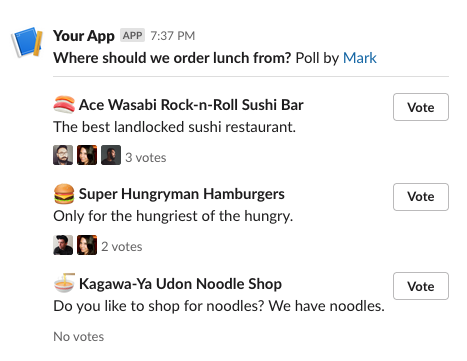

# Block Kit actions

Slack lets you build interactivity into your Slack app using [**Block Kit**](https://api.slack.com/block-kit). Block
Kit is a UI framework that lets you add interactive elements, such as buttons, input fields, datepickers etc. to
_surfaces_ like messages, modals and the App Home tab.

Slack Machine makes it easy to listen to _actions_ triggered by these interactive elements.

## Defining actions

When you're defining [blocks](https://api.slack.com/reference/block-kit ) for your interactive surfaces - either by
providing a [dict][] or by leveraging the [models of the Slack SDK for Python](https://tools.slack.dev/python-slack-sdk/api-docs/slack_sdk/models/blocks/index.html)
- each of these blocks can be given a `block_id`. Within certain blocks, you can place
[block elements](https://api.slack.com/reference/block-kit/block-elements) that are interactive. These interactive
elements can be given an `action_id`. Given that one block can contain multiple action elements, each `block_id` can
be linked to multiple `action_id`s.

Whenever the user interacts with these elements, an event is sent to Slack Machine that contains the `block_id` and
`action_id` corresponding to the block and element in which an action happened.

## Listening to actions

With the [`@action`][machine.plugins.decorators.action] decorator you can define which plugin methods should be
called when a certain action is triggered. The decorator takes 2 arguments: the `block_id` and the `action_id` that
you want to listen to. Both arguments are optional, but **one of them always needs to be set**. Both arguments accept a
[`str`][str] or [`re.Pattern`][re.Pattern]. When a string is provided, the handler only fires upon an exact match,
whereas with a regex pattern, you can have the handler fired for multiple matching `block_id`s or `action_id`s. This
is convenient when you want one handler to process multiple actions within a block, for example.

If only `action_id` or `block_id` is provided, the other defaults to `None`, which means it **always matches**.

### Parameters of your action handler

Your block action handler will be called with a [`BlockAction`][machine.plugins.block_action.BlockAction] object that
contains useful information about the action that was triggered and the message or other surface in which the action
was triggered.

You can optionally add the `logger` argument to your handler get a
[logger that was enriched by Slack Machine](misc.md#using-loggers-provided-by-slack-machine-in-your-handler-functions)

The [`BlockAction`][machine.plugins.block_action.BlockAction] contains various useful fields and properties about
the action that was triggered and the context in which that happened. The
[`user`][machine.plugins.block_action.BlockAction.user] property corresponds to the user that triggered the action
(e.g. clicked a button) and the [`channel`][machine.plugins.block_action.BlockAction.channel] property corresponds
to the channel in which the message was posted where the action was triggered. This property is `None` when the
action happened in a modal or the App Home tab.
The [`triggered_action`][machine.plugins.block_action.BlockAction.triggered_action] field holds information on the
action that triggered the handler, including any value that was the result of the triggered action - such as the
value of the button that was clicked. Lastly, the
[`payload`][machine.plugins.block_action.BlockAction.payload] holds the complete payload the was received by Slack
Machine when the action was triggered. Among other things, it holds the complete _state_ of the interactive blocks
within the message or modal where the action was triggered. This is especially useful when dealing with a _submit_
button that was triggered, where you want to collect all the information in a form for example.

### Example

Let's imagine you're building a plugin for your Slack Machine bot that allows users to vote for what to have for
lunch. You designed the following interaction:



Each lunch option has a vote button. Due to the way Block Kit works, to represent each option like this, they should
be in their own [section](https://api.slack.com/reference/block-kit/blocks#section). Each section will have the
description of the lunch option, the emoji and a button to vote. Sections are blocks, so we want to listen for
actions within different blocks.

This is what the handler could look like:

```python
@action(action_id=None, block_id=re.compile(r"lunch.*", re.IGNORECASE))
async def lunch_action(self, action: BlockAction, logger: BoundLogger):
    logger.info("Action triggered", triggered_action=action.triggered_action)
    food_block = [block for block in action.payload.message.blocks if block.block_id == action.triggered_action.block_id][0]
    food_block_section = cast(blocks.SectionBlock, food_block)
    food_description = str(food_block_section.text.text)
    msg = f"{action.user.fmt_mention()} has voted for '{food_description}'"
    await action.say(msg, ephemeral=False)
```

As you can see, we only care about the `block_id` here and not about the `action_id`. In the blocks that show the
lunch options, `block_id`s would be set like `lunch_ramen`, `lunch_hamburger` etc.

## Responding to an action

As you can see in the example, if you want to send a message to the user after an action was triggered, you can do
so by calling the [`say()`][machine.plugins.block_action.BlockAction.say] method on the _action_ object your handler
received from Slack Machine.
This works just like any other way Slack provides for sending messages. You can include just text, but also rich
content using [_Block Kit_](https://api.slack.com/block-kit)

!!! info

    The [`response_url`][machine.plugins.block_action.BlockAction.response_url] property is used by the
    [`say()`][machine.plugins.block_action.BlockAction.say] method to send messages to a channel after receiving a
    command. It does so by invoking a _Webhook_ using this `response_url` This is different from how
    [`message.say()`][machine.plugins.message.Message.say] works - which uses the Slack Web API.

    The reason for this is to keep consistency with how Slack recommends interacting with a user. For block actions,
    using the `response_url` is the [recommended way](https://api.slack.com/interactivity/handling#message_responses)

!!! warning

    The `response_url` is only available when the action was triggered in a message - as opposed to in a modal or
    the App Home tab. The reason is of course that in the other two cases there is no channel to send the message to.
